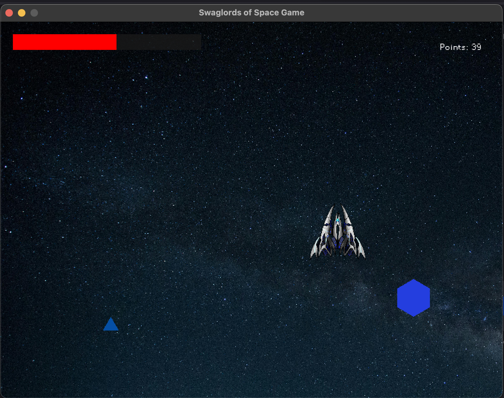

# Swaglords of Space

 <!-- Add a screenshot of your game here -->

## Overview

**Swaglords of Space** is a simple space-themed action game where players control a spaceship to shoot at enemies. The game is developed in C++ using SFML (Simple and Fast Multimedia Library).

## Features

- **Player Spaceship Control**: Move your spaceship to dodge enemies and fire bullets.
- **Basic Enemy System**: Engage with enemies appearing on the screen.
- **Basic Scoring**: Earn points by defeating enemies.
- **Simple Visuals**: Textures for the spaceship, bullets, and enemies add basic visual appeal.

## Requirements

### General Requirements

- **SFML 2.5 or higher**: Required for graphics, window management, and input handling.
- **C++17 Standard**: The project is built with C++17 compatibility.

### Platform-Specific Requirements

- **macOS**:
  - **Homebrew** (recommended for SFML installation): Install from [Homebrew’s website](https://brew.sh/).
  - **SFML Installation**: Run `brew install sfml`.

- **Windows**:
  - **SFML**: Download and install SFML from [the official website](https://www.sfml-dev.org/download/sfml/2.5.1/).
  - **CMake**: Ensure CMake is installed and added to the system PATH.
  - **Compiler**: Use a compatible C++ compiler, like MinGW or Visual Studio, that supports C++17.

- **Linux**:
  - **SFML**: Install SFML using your package manager (e.g., `sudo apt-get install libsfml-dev` for Debian-based distributions).
  - **CMake** and a **C++17 compatible compiler**.

## Installation and Setup

1. **Clone the Repository**:
   ```bash
   git clone https://github.com/yourusername/SwaglordsOfSpace.git
   cd SwaglordsOfSpace
   ```

2. **Build the Project with CMake**:

   ```bash
   mkdir build
   cd build
   cmake ..
   cmake --build .
   ```

   This will create an executable in the `build/bin` directory.

3. **Run the Game**:
   - Navigate to the `bin` directory:
     ```bash
     cd bin
     ./SFMLProject  # or SFMLProject.exe on Windows
     ```

## Platform-Specific Build and Run Instructions

### macOS

1. Install SFML via Homebrew:
   ```bash
   brew install sfml
   ```

2. Follow the **Installation and Setup** steps above.

### Windows

1. Download SFML for Windows and extract it to a known location (e.g., `C:/SFML`).
2. Follow the **Installation and Setup** steps, ensuring the `SFML_ROOT` in `CMakeLists.txt` is correctly set to the path where SFML is installed.
3. Run the game by double-clicking the executable in the `bin` directory.

### Linux

1. Install SFML using your package manager:
   ```bash
   sudo apt-get install libsfml-dev
   ```

2. Follow the **Installation and Setup** steps above.

## Directory Structure

- **`Bullet.cpp` and `Bullet.h`**: Defines bullet behavior, including movement and rendering.
- **`Enemy.cpp` and `Enemy.h`**: Defines basic enemy properties and behaviors.
- **`Game.cpp` and `Game.h`**: Manages the game loop, including initializing resources, processing input, updating game objects, and rendering.
- **`Player.cpp` and `Player.h`**: Controls player properties, movement, and rendering.
- **`main.cpp`**: Entry point of the game, sets up the game instance, and starts the game loop.
- **`CMakeLists.txt`**: CMake configuration file for building the project on different platforms.

## Controls

- **W, A, S, D Keys**: Move the spaceship.
- **Left-click Mouse**: Fire bullets.

## Troubleshooting

If the game fails to load assets (textures or fonts), ensure that the `Textures` and `Fonts` directories are correctly placed in the project root and are copied to the `bin` directory during the build process. This is handled by `CMakeLists.txt`, but you can manually copy them if needed.